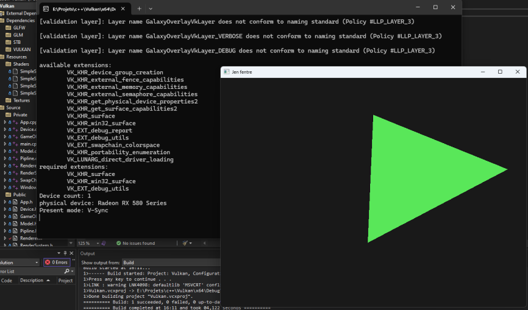

# Vulkouch
vulkouch is a very simple implementation of the Vulkan framework in c++
is implement a swap chain, pipeline and a basic renderer with gameobject

## Building it
you can build the project using the provided visual studio files on windows
then building it in the editor

## Screen

project build using lot of ressources from this tutorial: https://vulkan-tutorial.com/ 
